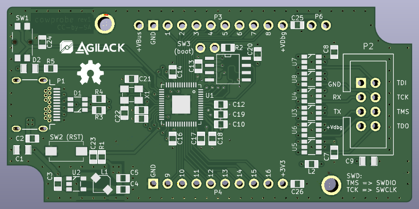

Cowprobe-RP
===========

The goal of this project is to create an universal debug probe (SWD, jtag...)
using RP2040 mcu. We know, there is plenty of USB probes for debug :) We
have decided to create this one to explore an approach based on network
communication.

